| Loss Functions | Mean | Median | RMSE | 5o | 11.25o | 22.5o | 30o|
|----------------|------|--------|------|---------------|-------------------|------------------|---------------|
| L2  | 7.72 | 7.23   | 8.39 | 73.55         | 79.88             |  87.72           |   90.43       |
| Cosine         | 7.63 | 7.14   | 8.31 | 73.89         | 80.04             |  87.29           |   90.48       |
| Quaternion     | 7.24 | 6.72   | 7.98 | 75.8          | 80.59             |  87.3            |   90.37       |
|Quaternion + Smooth|7.14| 6.66  | 7.88 | 76.16         | 80.82             | 87.45            |90.47          |

<h1 align="center"> Abstract </h1>

Omnidirectional vision is becoming increasingly relevant as more efficient 360o image acquisition is now possible.
However, the lack of annotated 360o datasets has hindered the application of deep learning techniques on spherical content. 
This is further exaggerated on tasks where ground truth acquisition is difficult, such as monocular surface estimation. 
While recent research approaches on the 2D domain overcome this challenge by relying on generating normals from depth cues 
using RGB-D sensors, this is very difficult to apply on the spherical domain. In this work, we address the unavailability 
of sufficient 360o ground truth normal data, by leveraging existing 3D datasets and remodelling them via rendering. 
We present a dataset of 360o images of indoor spaces with their corresponding ground truth surface normal, 
and train a deep convolutional neural network (CNN) on the task of monocular 360o surface estimation. 
We achieve this by minimizing a novel angular loss function defined on the hyper-sphere using simple quaternion algebra. 
We put an effort to appropriately compare with other state of the art methods trained on planar datasets and finally, 
present the practical applicability of our trained model on a spherical image re-lighting task using completely unseen data by 
qualitatively showing the promising generalization ability of our dataset and model.

<h1 align="center"> Data </h1>

  Coming Soon...

<h1 align="center"> Model </h1>

  Coming Soon...

<h1 align="center"> Paper </h1>

  <a href="https://arxiv.org/">
    

      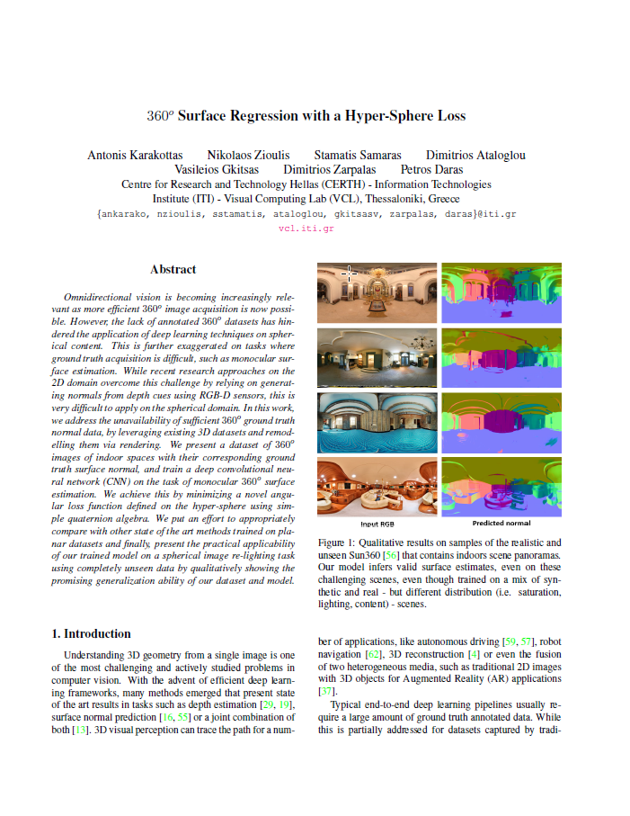
    

    

      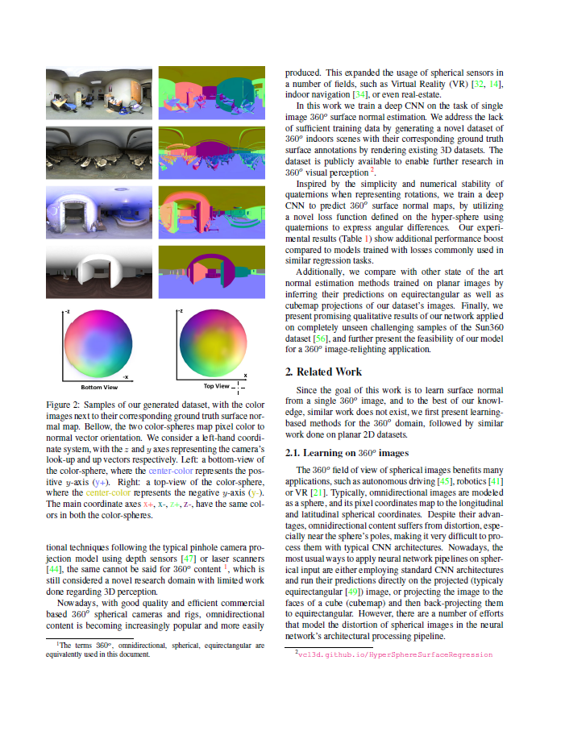
    

    

      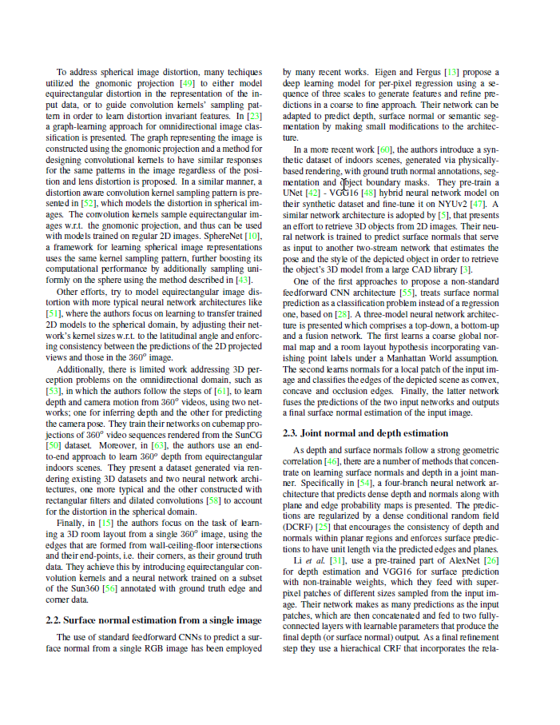
    

    

      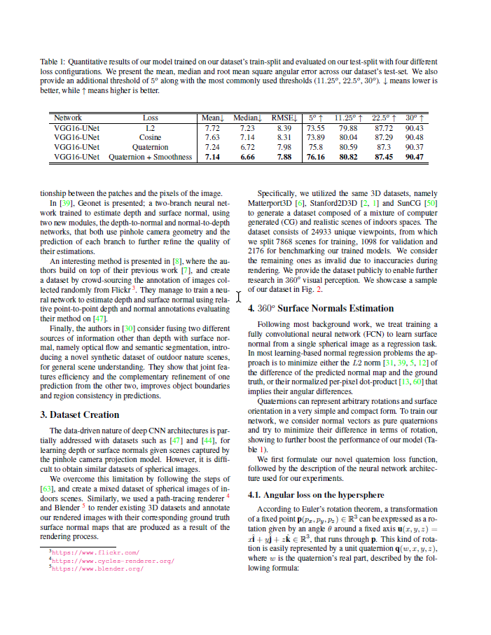
    

    

      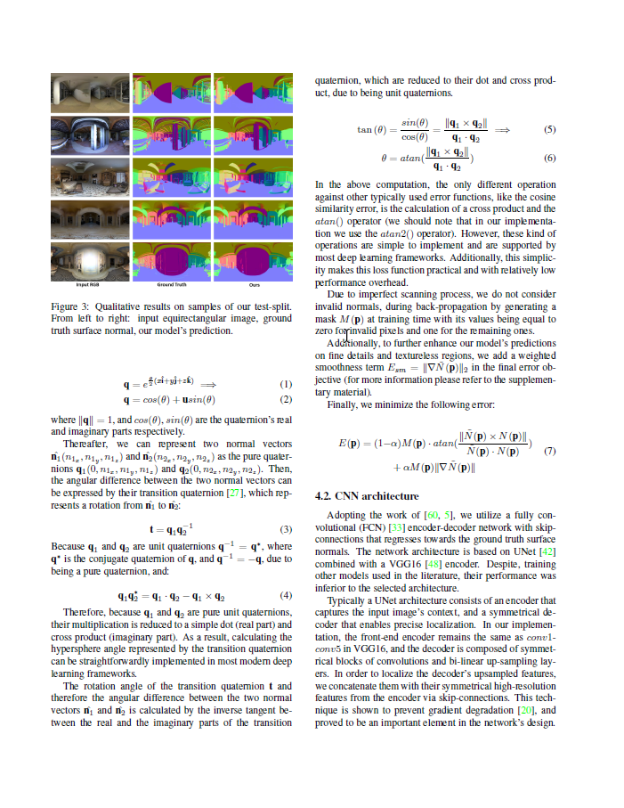
    

    

      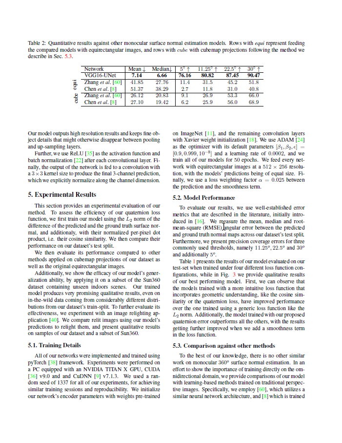
    

    

      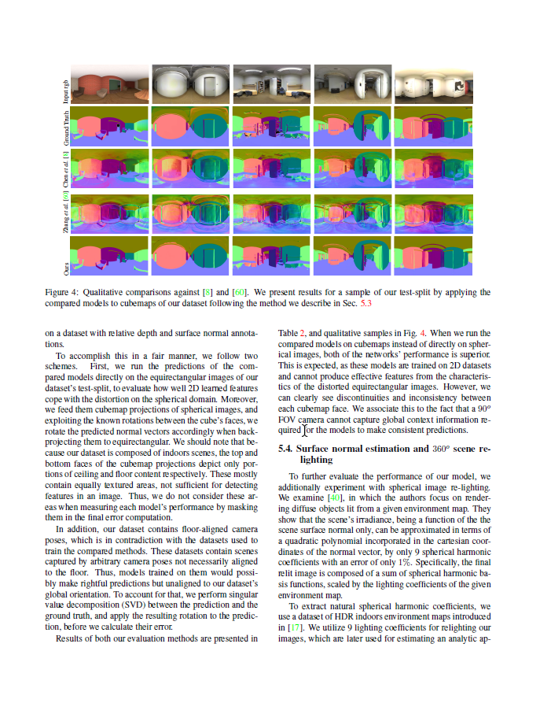
    

    

      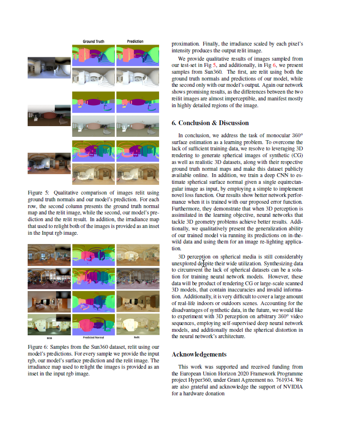
    

    

      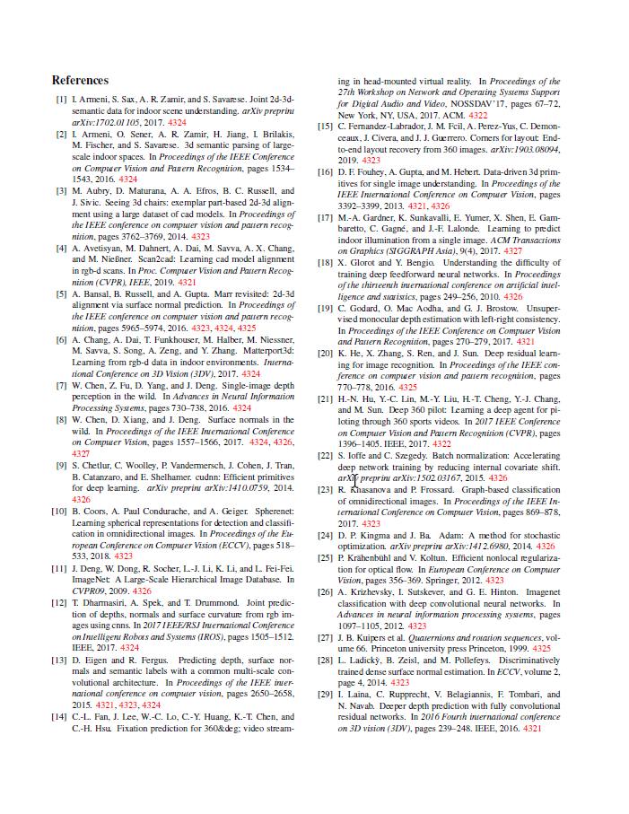
    

    

      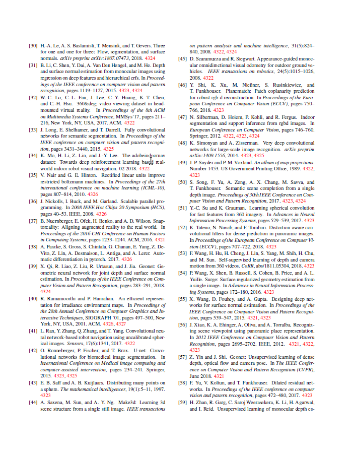
    

    

      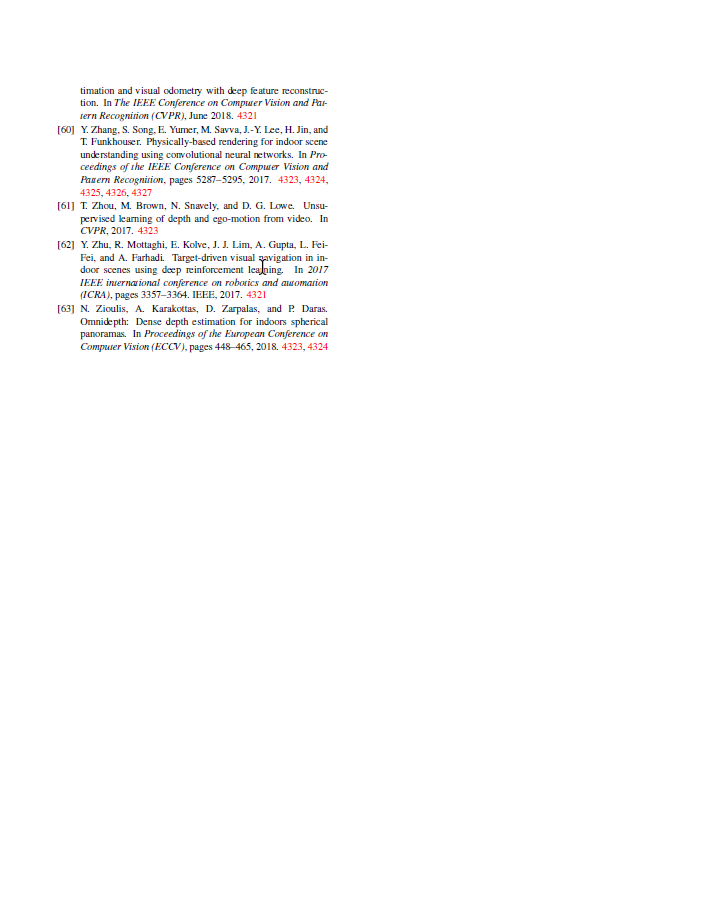
    

  </a>

<h2 align="center"> Supplementary </h2>

  <a href="https://arxiv.org/">
    

      
    

    

      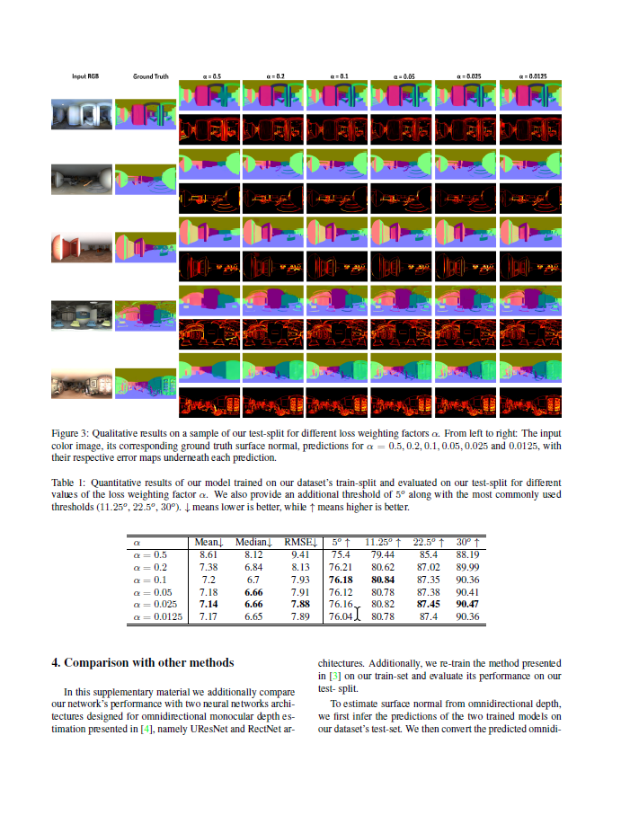
    

    

      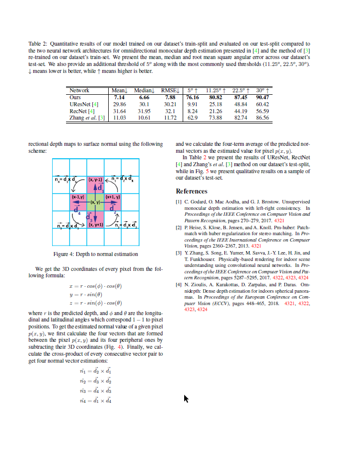
    

    

      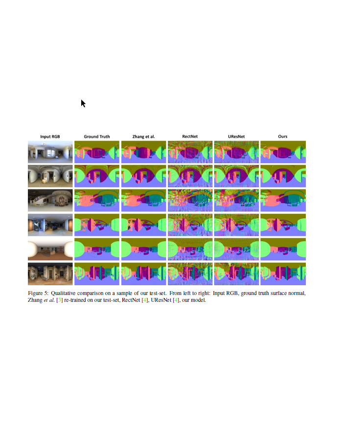
    

  </a>

<h1 align="center"> Citation </h1>

  <pre>
    <code>
      @inproceedings{karakottas2019360surface,
        author      = "Karakottas, Antonis and Zioulis, Nikolaos and Samaras, Stamatis and Ataloglou, Dimitrios and Gkitsas,              Vasileios and Zarpalas, Dimitrios and Daras, Petros",
        title       = "360 Surface Regression with a Hyper-Sphere Loss",
        booktitle   = "International Conference on 3D Vision",
        month       = "September",
        year        = "2019"
      }
    </code>
  </pre>

