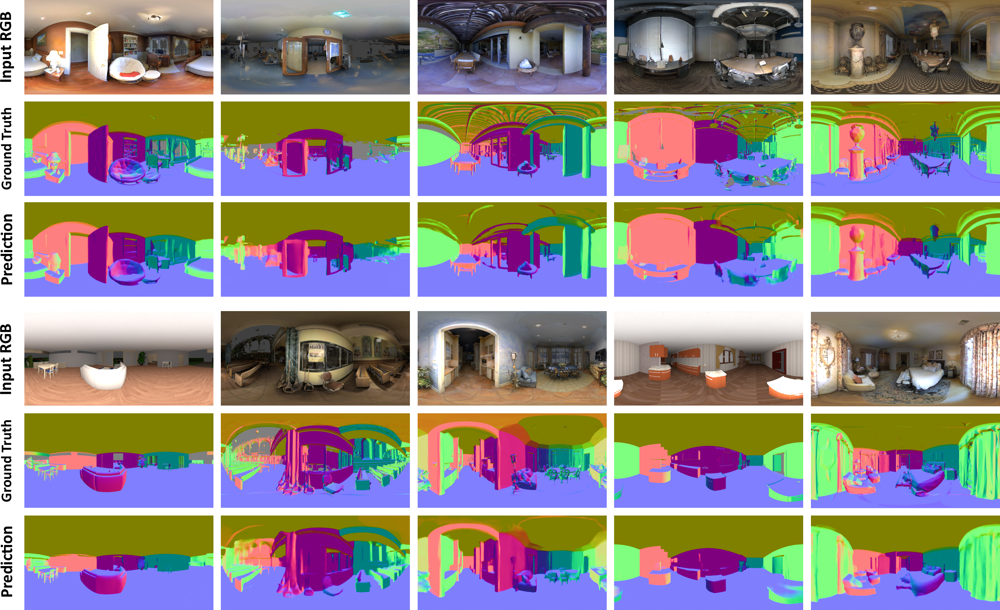
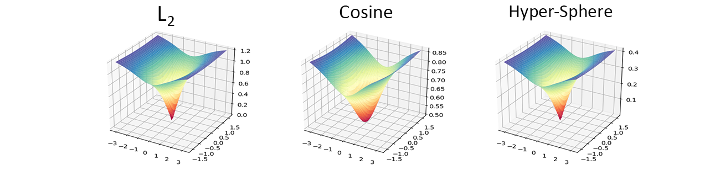
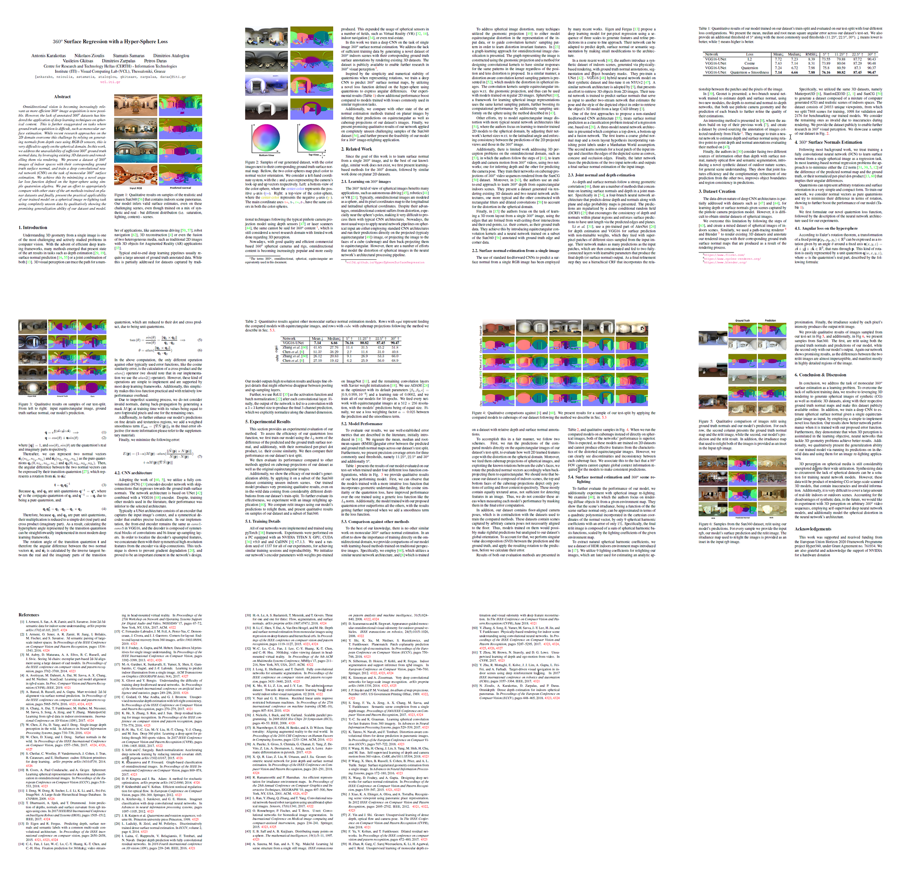
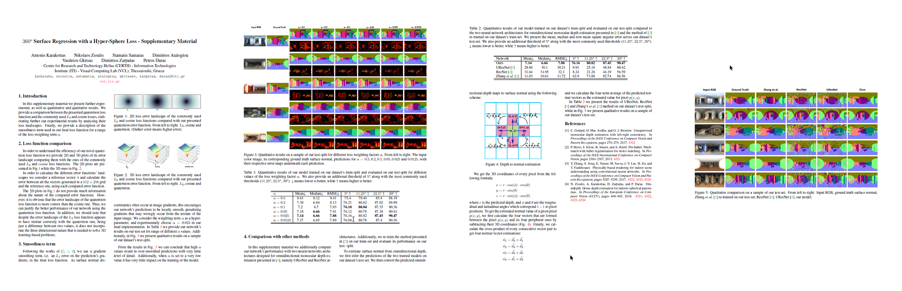

  

<h1 align="center"> Abstract </h1>

Omnidirectional vision is becoming increasingly relevant as more efficient 360o image acquisition is now possible.
However, the lack of annotated 360o datasets has hindered the application of deep learning techniques on spherical content. 
This is further exaggerated on tasks where ground truth acquisition is difficult, such as monocular surface estimation. 
While recent research approaches on the 2D domain overcome this challenge by relying on generating normals from depth cues 
using RGB-D sensors, this is very difficult to apply on the spherical domain. In this work, we address the unavailability 
of sufficient 360o ground truth normal data, by leveraging existing 3D datasets and remodelling them via rendering. 
We present a dataset of 360o images of indoor spaces with their corresponding ground truth surface normal, 
and train a deep convolutional neural network (CNN) on the task of monocular 360o surface estimation. 
We achieve this by minimizing a novel angular loss function defined on the hyper-sphere using simple quaternion algebra. 
We put an effort to appropriately compare with other state of the art methods trained on planar datasets and finally, 
present the practical applicability of our trained model on a spherical image re-lighting task using completely unseen data by 
qualitatively showing the promising generalization ability of our dataset and model.

<h1 align="center"> Angular Loss on the Hyper-Sphere </h1>

  According to Euler's rotation theorem, a transformation of a fized point <MATH> <b>p</b>(px, py, pz) can be expressed as a rotation given by an angle &thetasym; around a fixed axis <b>u</b>(x, y, z) = x<b>i&#x0302</b> + y<b>j&#x0302</b> + z<b>k&#x0302</b>, that runs through <b>p</b>. This kind of rotation can be easily represented by a unit quaternion <b>q</b>(w, x, y, z).</MATH>

  Therefore, we can represent two normal vectors <MATH> <b>n&#x03021</b>(n1x, n1y, n1z) and <b>n&#x03022</b>(n2x, n2y, n2z) as the pure quaternions <b>q1</b>(0, n1x, n1y, n1z) and <b>q2</b>(0, n2x, n2y, n2z) respectively. Then their angular difference can be expressed by their transition quaternion [ref], which represents a rotation from <b>n&#x03021</b> to <b>n&#x03022</b>:</MATH>

  <MATH> <b>t</b> = <b>q1</b> <b>q2-1</b> </MATH>

  <MATH> 
    Because <b>q1</b> and <b>q2</b> are unit quaternions: <b>q-1</b> = <b>q*</b>, where <b>q*</b> is the conjugate quaternion of <b>q</b>. 
  </MATH>

  <MATH>
    In addition, because <b>q1</b> and <b>q2</b> are pure quaternions: <b>q-1</b> = -<b>q</b>, and:
  </MATH>

  <MATH>
    <b>q1</b><b>q1*</b> = <b>q1</b> &sdot; <b>q2</b> - <b>q1</b> x <b>q2</b>
  </MATH>

  

  <MATH>
    Finally, the rotation angle of the transition quaternion (and therefore the angular difference between <b>n&#x03021</b> and <b>n&#x03022</b>) is calculated by the inverse tangent between the real and the imaginary parts of the transition quaternion, which are reduced to their dot and cross product, due to being unit quaternions:
  </MATH>

  <MATH>
    tan(&thetasym;) = &#8741 <b>q1</b> x <b>q2</b> &#8741  &frasl; (<b>q1</b> &sdot; <b>q2</b>)  &rArr;
  </MATH>

  <MATH>
    &thetasym; = atan(&#8741 <b>q1</b> x <b>q2</b> &#8741  &frasl; (<b>q1</b> &sdot; <b>q2</b>));
  </MATH>

<h2 align="center"> Quantitative Results using different Loss functions </h2>

  <table>
    <th> Loss Functions </th>
    <th> Mean </th>
    <th> Median </th>
    <th> RMSE </th>
    <th> 5o </th>
    <th> 11.25o </th>
    <th> 22.5o </th>
    <th> 30o </th>
    <tr>
      <td>L2</td>
      <td>7.72</td>
      <td>7.23</td>
      <td>8.39</td>
      <td>73.55</td>
      <td>79.88</td>
      <td>87.72</td>
      <td>90.43</td>
    </tr>
    <tr>
      <td>Cosine</td>
      <td>7.63</td>
      <td>7.14</td>
      <td>8.31</td>
      <td>73.89</td>
      <td>80.04</td>
      <td>87.29</td>
      <td>90.48</td>
    </tr>
    <tr>
      <td>Hyper-Sphere</td>
      <td>7.24</td>
      <td>6.72</td>
      <td>7.98</td>
      <td>75.8</td>
      <td>80.59</td>
      <td>87.3</td>
      <td>90.37</td>
    </tr>
    <tr>
      <td>Hyper-Sphere + Smoothness</td>
      <td>7.14</td>
      <td>6.66</td>
      <td>7.88</td>
      <td>76.16</td>
      <td>80.82</td>
      <td>87.45</td>
      <td>90.47</td>
    </tr>
  </table>

<!--
| Loss Functions | Mean | Median | RMSE | 5o | 11.25o | 22.5o | 30o|
|----------------|------|--------|------|---------------|-------------------|------------------|---------------|
| L2  | 7.72 | 7.23   | 8.39 | 73.55         | 79.88             |  87.72           |   90.43       |
| Cosine         | 7.63 | 7.14   | 8.31 | 73.89         | 80.04             |  87.29           |   90.48       |
| Quaternion     | 7.24 | 6.72   | 7.98 | 75.8          | 80.59             |  87.3            |   90.37       |
|Quaternion + Smooth|7.14| 6.66  | 7.88 | 76.16         | 80.82             | 87.45            |90.47          |
-->

<h2 align="center"> Loss Landscapes </h2>

  

<h1 align="center"> Data </h1>

  The 360o data used to train our model are available <a href="vcl3d.github.io/3D60">here</a> and are part of a larger dataset ... that composed of color images, depth, and surface normal maps for each viewpoint in a trinocular setup.

<h1 align="center"> Code </h1>

<h2 align="center"> Pre-trained model </h2>

  Coming Soon...

<h1 align="center"> Publication </h1>
<h2 align="center"> Paper </h2>

  

<h2 align="center"> Supplementary </h2>

  

<h1 align="center"> Citation </h1>

  <pre>
    <code>
      @inproceedings{karakottas2019360surface,
        author      = "Karakottas, Antonis and Zioulis, Nikolaos and Samaras, Stamatis and Ataloglou, Dimitrios and Gkitsas, Vasileios and Zarpalas, Dimitrios and Daras, Petros",
        title       = "360 Surface Regression with a Hyper-Sphere Loss",
        booktitle   = "International Conference on 3D Vision",
        month       = "September",
        year        = "2019"
      }
    </code>
   </pre>

<h1 align="center"> Acknowledgements </h1>

<h1 align="center"> References </h1>
